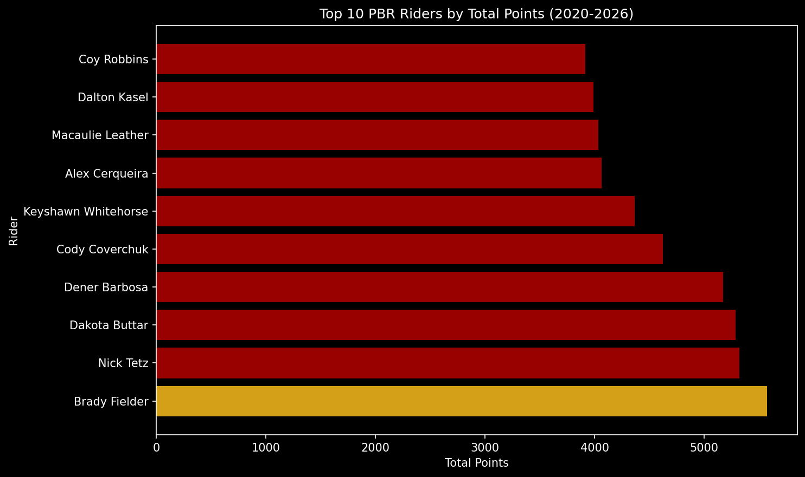
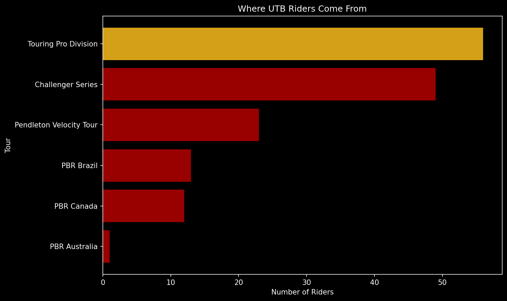
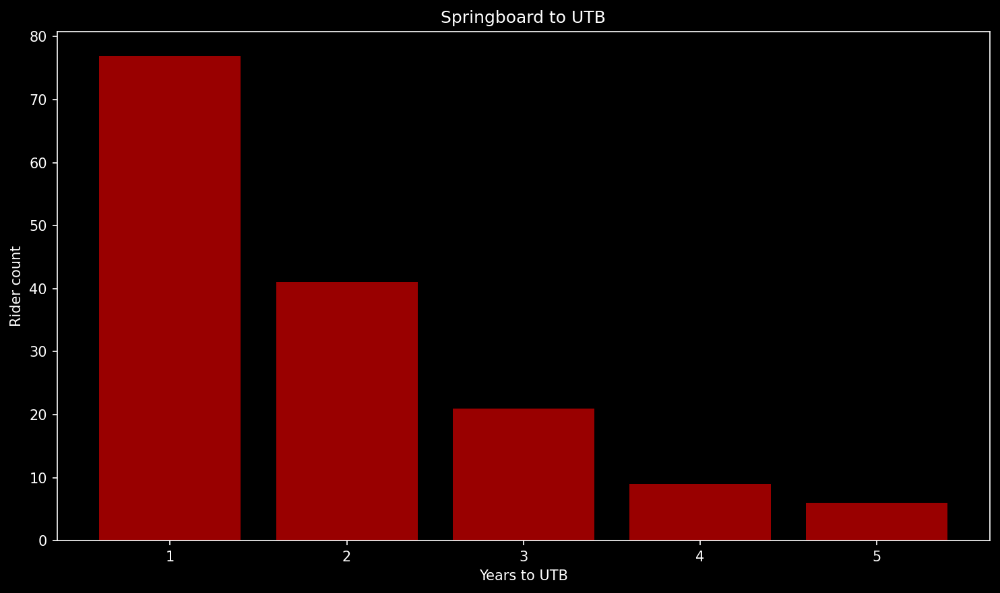
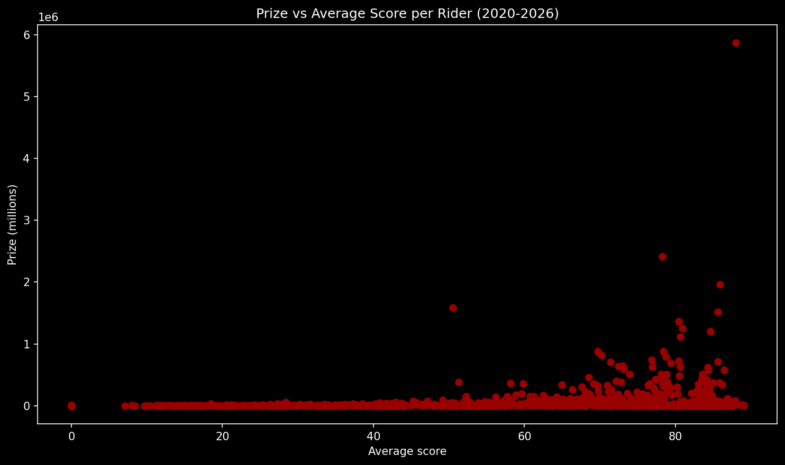
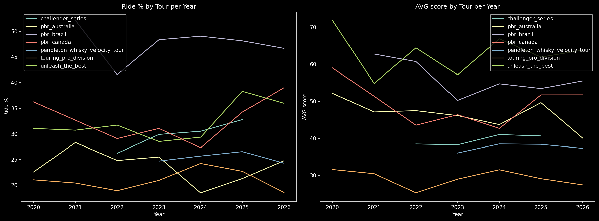
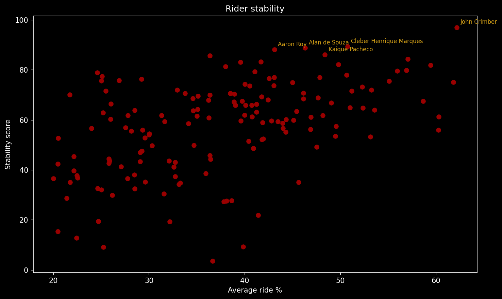

# PBR Analytics — End-to-End Data Analytics Project

## Research Question
**"What factors define success in PBR - stability, career path, or ride quality?"**

## 📊 Tableau Dashboard
🔗 [View Interactive Dashboard on Tableau Public](https://public.tableau.com/app/profile/ann.lutsenko/viz/PBR_17794526682620/PBR)

---

## 📁 Project Structure
```
PBR_Analytics/
│
├── data/
│   ├── riders_2020-2026_pbr.csv       # Main dataset
│   ├── years_to_utb.csv               # Years to reach UTB
│   ├── tour_springboard.csv           # Last tour before UTB debut
│   └── stability.csv                  # Rider stability metrics
│
├── visuals/
│   ├── top10_riders.png
│   ├── top5_riders.png
│   ├── tour_avg_ride%.png
│   ├── prize_vs_score.png
│   ├── tour_trends.png
│   ├── years_to_utb.png
│   ├── tour_springboard.png
│   └── stability.png
│
├── scraper.py                         # Web scraping from pbr.com
├── visualization.py                   # Matplotlib charts + data export
└── README.md
```

---

## 🛠️ Tech Stack
| Tool | Purpose |
|------|---------|
| Python (pandas, matplotlib, sqlalchemy) | Data collection, cleaning, visualization |
| PostgreSQL + pgAdmin | Data storage, SQL analysis |
| Tableau Public | Interactive dashboards |
| GitHub | Version control |

---

## 📦 Data
- **Source:** pbr.com (web scraping)
- **Period:** 2020–2026
- **Tours:** 7 (Touring Pro Division → Unleash The Best)
- **Rows:** 11,068
- **Columns:** rider, points, avg_score, prize_$, outs, rides, ride_%, tour, year

**Tour hierarchy (low → high):**
`Touring Pro Division` → `Challenger Series` → `PBR Australia/Brazil/Canada` → `Pendleton Whisky Velocity Tour` → `Unleash The Best`

---

## 🔍 Analysis & Key Insights

### 1. Top Riders (2020–2026)
Brady Fielder leads with 5,572 total points, followed by Nick Tetz (5,323) and Dakota Buttar (5,288). The top performers consistently competed across multiple tours and years.



---

### 2. Career Path to UTB
To identify the true springboard to the elite Unleash The Best tour, I analyzed the **last tour each rider competed in before their UTB debut** (excluding riders already in UTB in 2020, and accounting for the Challenger Series only existing from 2022).

| Tour | Riders |
|------|--------|
| Touring Pro Division | 56 |
| Challenger Series | 49 |
| Pendleton Whisky Velocity Tour | 23 |
| PBR Brazil | 13 |
| PBR Canada | 12 |
| PBR Australia | 1 |

**Key insight:** TPD remains the primary feeder to UTB. However, the Challenger Series (launched 2022) reached nearly the same numbers in just 4 years, showing its growing importance as an elite pipeline.

**50% of riders reach UTB within just 1 year** of joining PBR.




---

### 3. Ride Quality vs. Prize Money
UTB accounts for the majority of total prize money ($37M over 2020-2026), while Touring Pro Division distributes significantly less (~$3.4M). This suggests that **reaching a higher tour level has a greater impact on earnings than individual ride quality** - the tour you compete in determines your prize ceiling more than your personal performance metrics.



---

### 4. Tour Trends
PBR Brazil consistently shows the highest average Ride% (~33%), while Touring Pro Division has the lowest (~14%). UTB average ride% has been growing since 2023, suggesting increasing overall competition quality.

A notable peak in total points across all riders occurred in **2025**, potentially linked to the recovery of the full event calendar after COVID-19 disruptions in 2020–2022.



---

### 5. Rider Stability
Using **Coefficient of Variation (CV)** of ride% across years as a stability metric:

- **John Crimber** is the most stable active rider (CV = 2.58%, stability score = 97.05)
- Riders with both high average ride% AND high stability cluster in the top-right of the scatter plot
- Stability + ride quality together predict elite performance better than either metric alone



---

## 💡 Conclusions
1. **Career path matters** - TPD and Challenger Series are the main gateways to UTB
2. **Stability predicts success** - consistent performers outperform high-variance riders
3. **Tour level > ride quality** for prize earnings (correlation = 0.24)
4. **Speed of progression** - 50% of UTB riders got there within 1 year

---

## Author
**Anna Lutsenko**  
[LinkedIn](https://www.linkedin.com/in/anna-lutsenko-1a3253405/) | [Tableau Public](https://public.tableau.com/app/profile/ann.lutsenko)
